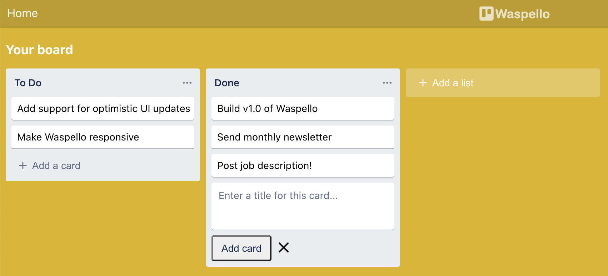

import Link from '@docusaurus/Link';
import useBaseUrl from '@docusaurus/useBaseUrl';
import InBlogCta from './components/InBlogCta';
import WaspIntro from './_wasp-intro.md';

    <Link to={'https://waspello.netlify.app/'}>Try Waspello here!</Link> | <Link to={'https://github.com/wasp-lang/wasp/blob/master/examples/waspello/main.wasp'}>See the code</Link>

<WaspIntro />
<InBlogCta />

 While building Wasp, our goal is to use it as much as we can to build our own projects and play with it, so we can learn what works and what we should do next. This is why Trello was a great choice of app to build with Wasp - it is one of the most well known full-stack web apps, it's very simple and intuitive to use  but also covers a good portion of features used in today's modern web apps.

<InBlogCta />
